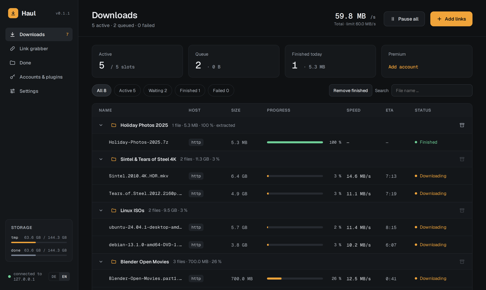

<div align="center">


# Haul

**The self-hosted download manager for file hosters.**<br>
Paste links or send them with Click'n'Load. Your server downloads, extracts and sorts them,
your browser shows it live.

[](https://github.com/firsttris/haul/actions/workflows/ci.yml)
[](https://hub.docker.com/r/tristanteu/haul)
[](https://hub.docker.com/r/tristanteu/haul)
[](https://hub.docker.com/r/tristanteu/haul/tags)
[](https://www.rust-lang.org/)
[](LICENSE)

[Features](#-features) •
[Hosters](#-supported-hosters) •
[Quick start](#-quick-start) •
[Documentation](docs/README.md) •
[Contributing](#-contributing)



</div>

## 💡 Why Haul?

JDownloader has the best hoster support there is, but it is a Java desktop app; on a server it runs
behind VNC or a cloud remote. pyLoad is made for servers, but many of its hoster plugins have fallen
behind. Haul is one small container built for a home server:

- **Headless from the start**: one Rust binary with an embedded web UI, no desktop, no VNC, no account
  in someone's cloud.
- **Light**: a Debian slim image with `7z` and `unrar`, SQLite, nothing else to run.
- **Hoster plugins you can fix yourself**: small TypeScript files, loaded from `/config/plugins` with
  one click, and a debug mode that saves exactly the pages a hoster sent.

## ✨ Features

- **Downloads**: parallel queue, segmented downloads over range requests, resume after restarts,
  retries with backoff, global bandwidth limit, live progress over Server-Sent Events
- **Hoster support**: premium accounts, free downloads with countdowns and waits,
  folder links resolved into their files, hoster-wide limits respected
- **Captchas**: simple ones solved by Haul, image captchas typed in the banner, reCaptcha, hCaptcha and
  Turnstile solved in your own browser through a userscript
- **Link grabber**: online check, package name, target folder and password before you start; pick
  single files with checkboxes
- **Browser extension** for Chrome and Firefox: Click'n'Load 1 and 2 without anything running on your
  desktop, and *Send to Haul* in the right-click menu
- **Auto-extract** of RAR, 7z and ZIP with progress, a password list that learns, and incomplete
  multi-part sets left alone until they are complete
- **Checksums** verified where the hoster publishes them (MD5, SHA-256, MEGA MAC)
- **Done view**: the download folder as it is on disk, with extract, move and delete
- **Password-protected files and folders**, asked for in the UI when needed
- **English and German UI**, including every message from the server and the plugins

## 🗂️ Supported hosters

| Hoster | Free | Account | Folders |
|---|:---:|:---:|:---:|
| **1fichier** | ✅ | API key | ✅ |
| **Datanodes** | ✅ | ✅ | |
| **ddownload** | | ✅ premium, API key | |
| **FileQ** | ✅ | ✅ | |
| **Filekeeper** | ✅ | ✅ | |
| **Gofile** | ✅ | API token | ✅ |
| **Google Drive** (incl. Docs export) | ✅ | browser cookies | ✅ |
| **MEGA** | ✅ | ✅ | ✅ |
| **Mediafire** | ✅ | ✅ | ✅ |
| **Send** (send.now, send.cm, tusfiles, userscloud) | ✅ | ✅ premium, API key | ✅ |

Plus every direct HTTP(S) link. Details per hoster: [docs/hosters.md](docs/hosters.md).

## 🐳 Quick start

```bash
mkdir haul && cd haul
curl -O https://raw.githubusercontent.com/firsttris/haul/main/docker/docker-compose.yml
# set APP_SECRET (openssl rand -hex 32) and your download folders, then
docker compose up -d
```

Open **http://localhost:8080**, create your login and add your hoster accounts under
*Accounts & plugins*.

<details>
<summary><b>docker run</b></summary>

```bash
docker run -d --name haul --restart unless-stopped \
  -p 8080:8080 -p 127.0.0.1:9666:9666 \
  -v ./config:/config \
  -v ./downloads/tmp:/downloads/tmp \
  -v ./downloads/done:/downloads/done \
  -e APP_SECRET="$(openssl rand -hex 32)" \
  tristanteu/haul:latest
```

</details>

<details>
<summary><b>Podman Quadlet</b></summary>

```bash
mkdir -p ~/.config/containers/systemd ~/haul/config ~/haul/downloads/{tmp,done}
curl -o ~/.config/containers/systemd/haul.container https://raw.githubusercontent.com/firsttris/haul/main/docker/haul.container
curl -o ~/.config/containers/systemd/haul.network https://raw.githubusercontent.com/firsttris/haul/main/docker/haul.network
# set APP_SECRET in haul.container, then
systemctl --user daemon-reload && systemctl --user start haul
```

</details>

| Volume | Content |
|---|---|
| `/config` | database and your own plugins |
| `/downloads/tmp` | downloads in progress |
| `/downloads/done` | finished downloads, one folder per package |

Everything else, from environment variables to a reverse proxy setup, is in the
[installation guide](docs/installation.md).

## 📚 Documentation

Also online at **[firsttris.github.io/haul](https://firsttris.github.io/haul/)**.

| | |
|---|---|
| [Installation](docs/installation.md) | Compose, Quadlet, volumes, environment variables, updates, reverse proxy |
| [Hosters](docs/hosters.md) | accounts, passwords, checksums, waits and limits |
| [Captchas](docs/captchas.md) | the userscript for reCaptcha, hCaptcha and Turnstile |
| [Extraction](docs/extraction.md) | archives, passwords, incomplete sets, the Done view |
| [Browser extension](docs/browser-extension.md) | Click'n'Load and *Send to Haul* in Chrome and Firefox |
| [Click'n'Load](docs/click-n-load.md) | how links from link sites reach the server, `haul-cnl` |
| [Plugins](docs/plugins.md) | writing and debugging hoster plugins |
| [Development](docs/development.md) | building, checks, architecture, API, releases |

## 🛠️ Development

Requires Rust (stable), Node.js 22 and pnpm.

```bash
git clone https://github.com/firsttris/haul
cd haul
pnpm install
pnpm dev        # server on :8080, UI with hot reload on :5173, login admin / adminadmin
```

**Stack**: Rust with tokio, axum, reqwest and SQLite · hoster plugins in TypeScript, run in QuickJS
inside the server · React, TanStack Router, Query and Table, embedded in the binary.
More in [docs/development.md](docs/development.md).

## 🤝 Contributing

A hoster changed its pages or one is missing? Issues and pull requests are welcome, plugins most of
all: see [writing plugins](docs/plugins.md). Please run `cargo test`, `cargo clippy`, `pnpm test` and
`pnpm typecheck` before opening a pull request.

## 📄 License

[GPL-3.0-or-later](LICENSE). Parts of the hoster plugins are based on JDownloader's GPL code, so the
whole repository is under the GPLv3.

---

<div align="center">
<sub>Haul is not affiliated with any file hoster, JDownloader or pyLoad. Use it only for files you
are allowed to download, and within the terms of the hosters you use.</sub>
</div>
