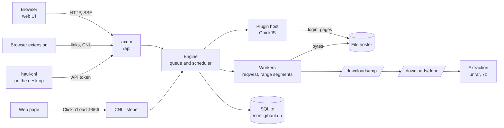
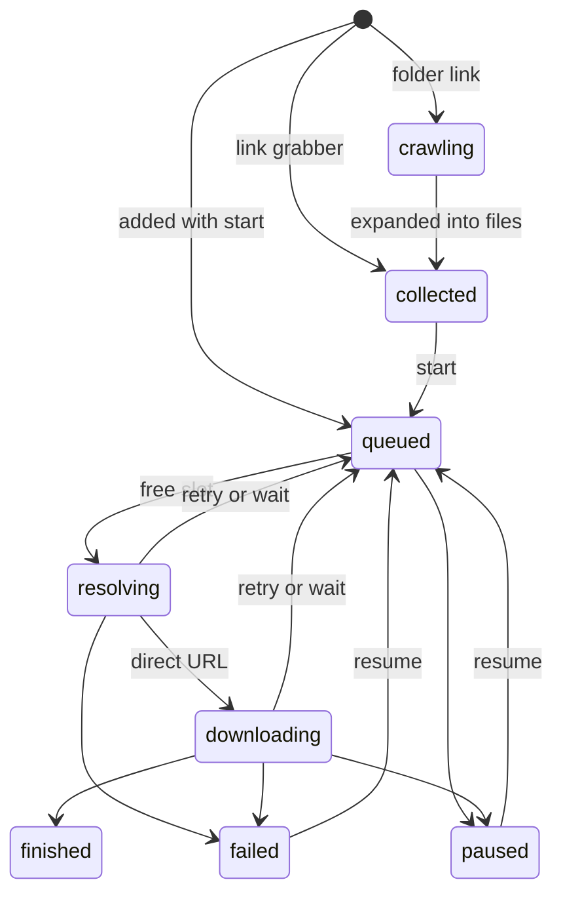

# Architecture

How Haul is put together: one Rust process that serves the web UI, runs the download queue and
executes the hoster plugins in an embedded JavaScript engine.

- [Overview](#overview)
- [Components](#components)
- [The life of a download](#the-life-of-a-download)
- [Folder links](#folder-links)
- [Hoster plugins](#hoster-plugins)
- [Captchas and passwords](#captchas-and-passwords)
- [Segmented downloads](#segmented-downloads)
- [Errors, retries and waits](#errors-retries-and-waits)
- [After the download](#after-the-download)
- [Live updates](#live-updates)
- [Data and security](#data-and-security)
- [Click'n'Load](#clicknload)
- [Texts and languages](#texts-and-languages)
- [Build and image](#build-and-image)

## Overview

The queue hands every link to the plugin of its hoster. The plugin logs in, solves what the hoster
asks for and returns only the direct URL of the file. The engine loads the bytes itself, in parallel
range segments, keeps the progress of each segment in SQLite and moves the finished file into the
package folder. A finished package is extracted, and the UI follows every step live.

## Components

| Part | Where | Choice |
|---|---|---|
| HTTP server and API | `crates/haul/src/api.rs`, `auth.rs` | Rust, tokio, axum, gzip and brotli for the UI and JSON |
| Queue and scheduler | `crates/haul/src/engine/mod.rs` | one task that fills free slots every 2 seconds or when woken |
| Download workers | `crates/haul/src/engine/worker.rs` | reqwest with a cookie jar per account, range segments |
| Plugin host | `crates/haul/src/plugins/` | TypeScript bundled with esbuild, run in rquickjs |
| Captchas and questions | `crates/haul/src/captcha.rs` | challenges the UI answers, the userscript for token captchas |
| Extraction | `crates/haul/src/engine/extract.rs` | `unrar` for RAR, `7z` for everything else and as fallback |
| Checksums and decryption | `engine/hash.rs`, `engine/crypt.rs` | MD5, SHA-1, SHA-256, MEGA MAC; AES-CTR for MEGA |
| Done view | `crates/haul/src/files.rs` | browse, move, delete inside the done folder only |
| Database | `crates/haul/src/db.rs`, `migrations/` | SQLite via sqlx, migrations run at start |
| Live updates | `crates/haul/src/events.rs` | Server-Sent Events on `/api/events` |
| Click'n'Load | `crates/haul/src/cnl.rs`, `crates/haul-cnl` | listener on `:9666`, forwarder for the desktop |
| Web UI | `ui/` | Vite, React, TanStack Router, Query and Table, embedded with rust-embed |
| Plugin SDK | `packages/plugin-sdk` | types, helpers, XFileSharing base, test context |
| Browser extension | `extension/` | Chrome and Firefox, Click'n'Load and *Send to Haul* |

At start the server reads its [environment variables](installation.md#environment-variables),
creates the folders, opens the database, loads the plugins, creates the first user if there is none,
and starts the API, the Click'n'Load listener and the scheduler. On `SIGTERM` or Ctrl+C it stops all
workers and waits up to 10 seconds for each to save its progress.

## The life of a download

Every download has one status. Packages group downloads and own the target folder and passwords.

1. **Added**: `POST /api/links`, the browser extension or Click'n'Load create a package. Links stay in
   the link grabber (`collected`) unless they were added with *start*. Click'n'Load links always stay
   there.
2. **Online check**: plugins with a `check` function report name, size, checksum and whether the file
   is online, before anything is downloaded.
3. **Queued**: the scheduler starts downloads in package order, as many as the setting *Parallel
   downloads* allows, and skips those whose `retry_at` lies in the future.
4. **Resolving**: the worker calls the plugin's `resolve` with an account of that hoster, if one is
   enabled. The plugin returns the direct URL, and optionally headers, a file name, a checksum, a key to
   decrypt the file and a connection limit.
5. **Downloading**: the worker probes the URL, plans the segments and streams them into
   `<tmp>/<id>.part`.
6. **Finished**: the checksum is verified if there is one, the file moves to `<done>/<package folder>/` under a free
   name, and the package is extracted once all its downloads are done.

When the server starts, everything that was resolving or downloading goes back to the queue, and the
saved segment progress lets it continue where it stopped.

## Folder links

A plugin with a `crawl` function expands a folder link into its files when the link is added. Until
then the link has the status `crawling`, and the downloader leaves it alone. Each file found becomes
its own download, with the folder's password and the checksum the hoster lists. Crawls that were
running when the server stopped start again. Changes the user made meanwhile, like a new package
name, are kept.

## Hoster plugins

A plugin is a TypeScript file that `scripts/build-plugins.mjs` bundles into one script per hoster
(`plugins/dist/<name>.js`). The built-in plugins sit in `/app/plugins` in the image. Your own go to
`/config/plugins` and win over a built-in one with the same id.

A plugin declares its `id`, the URL patterns it `matches`, its account form and up to four functions:

| Function | Called | Returns |
|---|---|---|
| `check(link, ctx)` | online check | name, size, checksum, online or offline |
| `crawl(link, ctx)` | when a folder link is added | the files and a folder name |
| `resolve(link, ctx)` | before every download attempt | direct URL, headers, name, checksum, decryption key |
| `checkAccount(ctx)` | when an account is added or checked | premium, traffic left, valid until |

The plugin host runs every call in a fresh QuickJS runtime, so a plugin keeps no state between calls
and a broken call cannot affect the next one. Limits per call:

| Limit | Value |
|---|---|
| Time per call, without the time a captcha waits for you | 5 minutes |
| Memory | 64 MiB |
| Stack | 1 MiB |

Plugins have no network or file access of their own. They reach the hoster through `ctx.http`, which
the Rust side carries out with the account's cookie jar. Logins therefore survive between calls,
and the session is saved with the account. Heavy crypto runs in Rust through `ctx.crypto`. With
`RUST_LOG=haul=debug` the pages a failed call received are saved next to the download, see
[Debugging a hoster](plugins.md#debugging-a-hoster).

## Captchas and passwords

reCaptcha, hCaptcha and Turnstile tokens only work on the hoster's own domain. A plugin that meets one
calls `ctx.captcha.solve(...)`, and the call waits while the UI shows the captcha in a banner.
*Solve* opens the hoster's page with the challenge in the URL fragment. The
[userscript](captchas.md) replaces that page with the captcha widget and sends the token back,
signed with the challenge's one-time secret.

Image captchas are loaded with the plugin's cookies and shown in the banner, where you type the
answer. Download passwords (`ctx.password.get()`) and archive passwords that none of the known ones
fit are asked the same way. A question waits a limited time and then counts as unanswered.

## Segmented downloads

If the server supports range requests and the size is known, the file is split into segments of at
least 4 MiB. Their number is the setting *Connections per file*, capped by the plugin's limit for
that hoster. Each segment writes at its own offset into the same `.part` file. Progress is flushed
every 8 MiB and saved in the `segments` table, so a pause, a restart or a crash loses at most that
much.

A segment that fails is retried up to 3 times on its own. If the hoster refuses extra connections
(429 or 503) while another segment is loading, the refused one waits and asks again later, so the
download continues with fewer connections. All downloads share one *Bandwidth limit*.

MEGA stores files encrypted with AES-128-CTR. CTR can decrypt at any offset, so every segment
decrypts its own bytes, also after a resume.

## Errors, retries and waits

A failed attempt ends in one of these outcomes:

| Outcome | Example | What happens |
|---|---|---|
| Retry | network error, server busy | back to the queue with backoff from 10 s doubling up to 10 min, until the setting *Retries* is used up |
| Wait | free download limit, countdown | queued until the time the hoster named, without using up an attempt |
| Hoster wait | IP blocked by the hoster | like Wait, for every download from that hoster |
| Offline | file deleted | failed, marked offline |
| Fail | wrong password, account needed | failed, needs you |

The error text stays with the download, so the UI shows why it waits or failed.

## After the download

- **Checksum**: if the hoster published one and *Verify the checksum* is on, the file is verified
  before it moves. One
  check runs at a time, the others wait, because several would only compete for the disk.
- **Extraction**: with *Extract finished packages automatically* on, a package is extracted once all
  its downloads are done. RAR goes to `unrar` first, everything else and the fallback to `7z`
  (`HAUL_UNRAR` and `HAUL_7Z` point to other binaries). Haul tries no password, then the package's
  passwords, the archive's name and the archive password list, and only then asks you. A password
  that works moves to the top of the list. Multi-part sets wait until all parts are there. See
  [Extraction](extraction.md).
- **Done view**: shows the done folder as it is on disk. Every path from the browser is resolved
  relative to the done folder and refused if it would leave it, also through symlinks.

## Live updates

The UI keeps one Server-Sent Events connection to `/api/events` with two kinds of events:

- `changed` with a topic (`downloads`, `accounts`, `plugins`, `settings`, `files`, `captchas`): the UI
  refetches that list with TanStack Query.
- `progress`, about once a second: bytes and speed of every running download, the total speed, and
  the extraction progress of each package.

## Data and security

Everything lives in `/config/haul.db`:

| Table | Content |
|---|---|
| `packages` | name, target folder, passwords, link grabber or queue, extraction state |
| `downloads` | URL, plugin, status, size, progress, error, attempts, next try, checksum, password |
| `segments` | byte ranges of a download and how far each got |
| `accounts` | hoster accounts, secrets encrypted, premium state, traffic, saved session |
| `settings` | key-value settings and the archive password list |
| `sessions` | hashes of login sessions |

- **Account secrets** are encrypted with a key derived from `APP_SECRET`. The database alone does
  not reveal passwords or API keys, and a different `APP_SECRET` cannot read them.
- **Logins** are checked against an Argon2 hash. A session cookie lasts 30 days, and only its hash is
  stored.
- **API tokens** for `haul-cnl` and scripts are shown once. Only their hash is stored. They are sent
  as `Authorization: Bearer <token>`.

## Click'n'Load

Link sites POST to `127.0.0.1:9666` on the machine that runs the browser. Haul answers there itself
when it runs on the same machine. On a server, the [browser extension](browser-extension.md) or
[`haul-cnl`](click-n-load.md) take the request on the desktop and send it to `/api/cnl/flash/*`. CNL2
payloads are decrypted in their own QuickJS runtime without any host functions. The links always land
in the link grabber, never directly in the queue.

## Texts and languages

The server does not render texts. It sends a message key with its inputs, and the UI renders it in
the viewer's language from `ui/messages/{de,en}.json`. A stored error therefore shows in whatever
language you pick later. Details for contributors are in [Development](development.md#texts).

## Build and image

`docker/Dockerfile` has three stages:

1. **web** (Node 22): builds the plugins and the UI.
2. **server** (Rust): builds the `haul` binary with the UI embedded.
3. **runtime** (Debian slim): the binary, the plugins in `/app/plugins`, `7z` and `unrar`.

The release builds the image for `linux/amd64` and `linux/arm64`, each on its own native runner. See
[Releases](development.md#releases).
